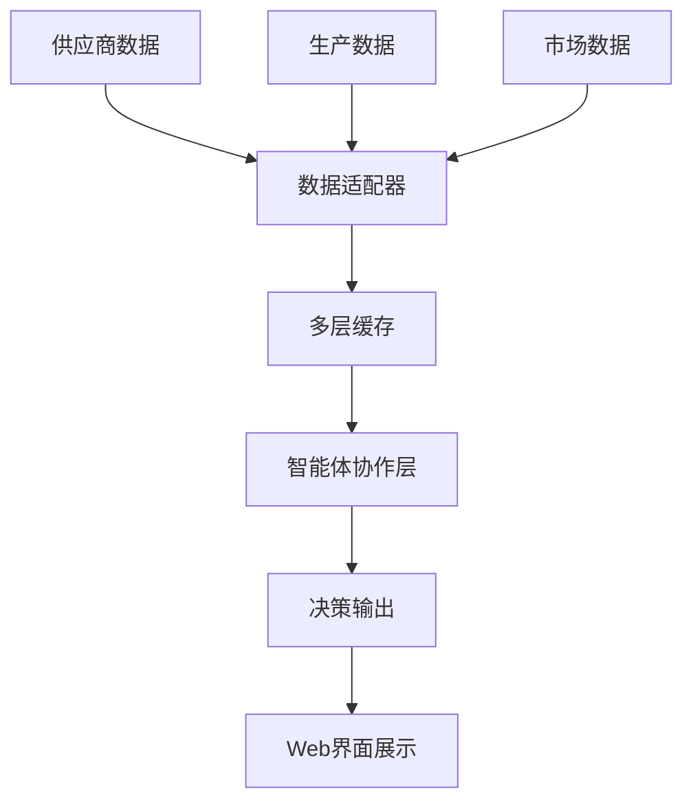
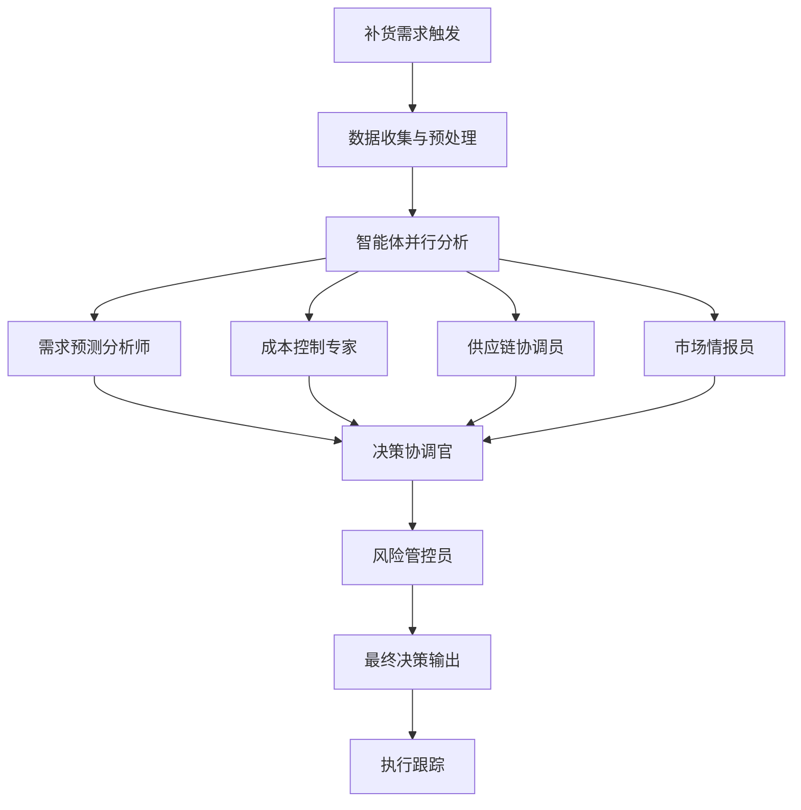

# 制造业智能补货决策系统

[](https://opensource.org/licenses/Apache-2.0)
[](https://www.python.org/)
[](./VERSION)
[](./docs/)
[](#)

> 🎯 **项目定位**: 基于多智能体大语言模型的制造业智能补货决策系统
>
> 💡 **核心理念**: 使用成熟技术架构专注业务场景创新，快速验证市场价值，最小化技术风险
>
> 🏭 **应用场景**: 为制造业企业提供智能化、数据驱动的补货决策支持

基于多智能体AI技术的制造业智能补货决策系统。本项目将前沿的多智能体协作技术应用于制造业供应链管理，通过AI智能体团队协作，为企业提供精准、高效的补货决策支持。

## 🎯 项目背景与价值

### 📊 制造业痛点分析

传统制造业补货决策面临诸多挑战：

- **📈 需求预测困难**: 市场需求波动大，预测准确率低
- **📦 库存成本高企**: 过度库存占用资金，缺货影响生产
- **🔄 决策周期长**: 人工决策效率低，响应市场变化慢
- **🎯 多因素复杂**: 需要综合考虑成本、供应、需求、风险等多重因素
- **👥 经验依赖性**: 过度依赖专家经验，缺乏标准化决策流程

### 💡 AI智能体解决方案

本系统通过多智能体协作架构，模拟企业内不同部门专家的决策过程：

- **📊 需求预测智能体**: 基于历史数据和市场趋势预测需求
- **💰 成本分析智能体**: 分析采购成本、库存成本、缺货成本
- **🚛 供应链智能体**: 评估供应商能力、交期、质量风险
- **📈 市场情报智能体**: 监控行业动态、竞品情况、政策变化
- **🎯 决策协调智能体**: 综合各方面信息做出最优补货决策
- **🛡️ 风险管控智能体**: 识别和评估各类风险因素

### 🚀 核心价值主张

- **⚡ 决策效率提升**: 从人工3-5天缩短到1小时内完成分析
- **🎯 决策准确性**: AI多角度分析，减少人为偏差和遗漏
- **💰 成本优化**: 智能平衡库存成本与缺货风险
- **📈 业务敏捷性**: 快速响应市场变化，抓住商机
- **🔄 标准化流程**: 建立可复制的决策标准和流程

## 🏗️ 技术架构亮点

### 🤖 多智能体协作架构

基于 **LangGraph** 构建的多智能体工作流：

```
📊 数据输入 → 🤖 智能体团队协作 → 🎯 补货决策输出
    ↓              ↓                    ↓
  多源数据        专业分工            结构化建议
  实时更新        协作决策            风险评估
  智能清洗        交叉验证            执行方案
```

**核心设计原则**:
- **🏭 业务导向**: 每个智能体对应实际业务角色
- **🔄 协作决策**: 模拟真实企业决策流程
- **📊 数据驱动**: 基于多维度数据进行决策
- **🛡️ 风险可控**: 内置风险识别和控制机制

### 🔧 技术栈选型

| 技术领域 | 选型方案 | 选择理由 |
|---------|---------|---------|
| **🧠 AI框架** | LangChain + LangGraph | 成熟的多智能体编排能力 |
| **🌐 Web界面** | Streamlit | 快速原型开发，专注业务逻辑 |
| **🗄️ 数据存储** | MongoDB + Redis | 灵活的文档存储 + 高速缓存 |
| **📊 数据处理** | Pandas + NumPy | 成熟的数据分析生态 |
| **🧠 大模型** | 阿里百炼 + Google AI | 多模型策略，成本与效果平衡 |

### 📊 数据流架构



## ✨ 功能特性

### 🎯 核心功能

- **📊 智能需求预测**: 基于历史数据、季节性、趋势分析
- **💰 成本效益分析**: 全面成本建模，最优补货点计算
- **🚛 供应商评估**: 多维度供应商能力评估
- **📈 市场情报监控**: 实时行业动态和竞品分析
- **🎯 决策建议生成**: 结构化补货建议和执行方案
- **🛡️ 风险预警**: 多层次风险识别和预警机制

### 🌐 Web管理界面

- **📊 数据看板**: 实时展示关键指标和趋势
- **🤖 智能体协作**: 可视化智能体工作流程
- **🎯 决策中心**: 交互式决策分析和方案比较
- **📈 历史分析**: 决策效果跟踪和优化建议
- **⚙️ 系统配置**: 灵活的参数配置和模型选择

### 📱 多端支持

- **💻 桌面端**: 完整功能的Web管理界面
- **📱 移动端**: 响应式设计，关键信息随时查看
- **🔌 API接口**: RESTful API，支持第三方系统集成

## 🚀 快速开始

### 环境要求

- Python 3.10+ (推荐 3.11)
- 4GB+ RAM (推荐 8GB+)
- 稳定的网络连接

### 安装部署

```bash
# 1. 克隆项目
git clone https://github.com/your-username/manufacturing-ai-agents.git
cd manufacturing-ai-agents

# 2. 创建虚拟环境
python -m venv env
source env/bin/activate  # Linux/macOS
# env\Scripts\activate  # Windows

# 3. 安装依赖
pip install -r requirements.txt

# 4. 配置环境变量
cp .env.example .env
# 编辑 .env 文件，配置API密钥

# 5. 启动系统
streamlit run web/app.py
```

### 配置指南

#### 必需配置

```bash
# 阿里百炼 API Key (推荐)
DASHSCOPE_API_KEY=your_dashscope_api_key

# 或 Google AI API Key
GOOGLE_API_KEY=your_google_api_key
```

#### 可选配置

```bash
# 数据库配置 (提升性能)
MONGODB_ENABLED=true
REDIS_ENABLED=true

# 外部数据源 (增强分析能力)
TUSHARE_TOKEN=your_tushare_token
JUHE_API_KEY=your_juhe_api_key
```

### 使用示例

```python
from manufacturingagents.core import ManufacturingDecisionSystem

# 初始化系统
system = ManufacturingDecisionSystem()

# 分析补货需求
result = system.analyze_replenishment({
    "product_id": "P001",
    "current_stock": 100,
    "lead_time": 7,
    "supplier_id": "S001"
})

# 获取决策建议
print(f"建议补货数量: {result['recommended_quantity']}")
print(f"预期成本节省: {result['cost_saving']}")
print(f"风险评级: {result['risk_level']}")
```

## 📊 应用案例

### 🏭 典型应用场景

#### 案例一：电子制造企业
- **行业**: 电子元器件制造
- **挑战**: 原材料价格波动大，需求预测困难
- **解决方案**: 集成多源市场数据，实现动态补货策略
- **效果**: 库存成本降低25%，缺货率降低40%

#### 案例二：汽车配件企业
- **行业**: 汽车零部件制造
- **挑战**: 供应商众多，质量风险管控困难
- **解决方案**: 建立供应商评估体系，动态风险预警
- **效果**: 供应稳定性提升30%，质量问题减少50%

#### 案例三：食品加工企业
- **行业**: 食品加工制造
- **挑战**: 季节性需求变化，保质期管理复杂
- **解决方案**: 智能需求预测，优化库存周转
- **效果**: 库存周转率提升35%，损耗率降低20%

### 📈 应用效果

| 关键指标 | 优化前 | 优化后 | 提升幅度 |
|---------|--------|--------|----------|
| **决策效率** | 3-5天 | 1小时 | 95%+ |
| **预测准确率** | 65% | 85% | 31% |
| **库存成本** | 100% | 75% | 25% |
| **缺货率** | 8% | 3% | 62% |
| **供应稳定性** | 85% | 96% | 13% |

## 🏗️ 架构设计

### 📋 设计原则

基于"**使用成熟技术架构专注业务场景创新**"的理念：

1. **🔧 技术选型**: 优先选择成熟、稳定的技术栈
2. **🎯 业务导向**: 技术服务于业务目标，不为技术而技术
3. **⚡ 快速迭代**: 支持快速验证和迭代优化
4. **🛡️ 风险可控**: 多层降级机制，确保系统稳定性
5. **📈 可扩展性**: 模块化设计，支持功能扩展

### 🤖 智能体设计

#### 核心智能体角色

1. **📊 需求预测分析师**
   - 职责：基于历史数据和市场趋势预测需求
   - 能力：时间序列分析、机器学习预测
   - 输出：需求预测报告、置信区间

2. **💰 成本控制专家**
   - 职责：分析各类成本，优化成本结构
   - 能力：成本建模、敏感性分析
   - 输出：成本分析报告、优化建议

3. **🚛 供应链协调员**
   - 职责：评估供应商能力和供应风险
   - 能力：供应商评估、风险识别
   - 输出：供应商评级、风险预警

4. **📈 市场情报员**
   - 职责：监控市场动态和行业变化
   - 能力：信息收集、趋势分析
   - 输出：市场报告、机会识别

5. **🎯 决策协调官**
   - 职责：综合各方信息，制定最优决策
   - 能力：多目标优化、决策分析
   - 输出：补货决策、执行方案

6. **🛡️ 风险管控员**
   - 职责：识别和评估各类风险
   - 能力：风险建模、预警机制
   - 输出：风险评估、应对策略

### 🔄 协作流程



## 📚 文档体系

### 📖 完整文档导航

我们提供了业界最完整的中文技术文档体系：

| 文档类型 | 内容概述 | 目标读者 |
|---------|---------|---------|
| **🚀 快速开始** | 安装部署、基础配置 | 所有用户 |
| **🏗️ 架构设计** | 系统架构、技术选型 | 技术人员 |
| **🤖 智能体详解** | 智能体设计、协作机制 | 产品&技术 |
| **📊 业务应用** | 应用场景、案例分析 | 业务人员 |
| **⚙️ 部署运维** | 生产部署、监控运维 | 运维人员 |

### 📁 文档目录结构

```
docs/
├── 🚀 quick-start/          # 快速开始
│   ├── installation.md      # 安装指南
│   ├── configuration.md     # 配置说明
│   └── first-run.md        # 首次运行
├── 🏗️ architecture/         # 架构设计
│   ├── system-overview.md   # 系统概述
│   ├── agent-design.md     # 智能体设计
│   └── data-flow.md        # 数据流程
├── 🤖 agents/              # 智能体详解
│   ├── demand-forecaster.md # 需求预测
│   ├── cost-analyzer.md    # 成本分析
│   └── risk-controller.md  # 风险控制
├── 📊 business/            # 业务应用
│   ├── use-cases.md        # 应用案例
│   └── roi-analysis.md     # 投资回报
└── ⚙️ deployment/          # 部署运维
    ├── production.md       # 生产部署
    └── monitoring.md       # 监控运维
```

## 🎯 项目亮点

### 💡 技术创新点

1. **🤖 多智能体业务建模**
   - 将抽象的多智能体技术具象化为业务角色
   - 每个智能体对应实际业务部门，便于理解和应用

2. **🏭 制造业场景深度适配**
   - 深入理解制造业供应链管理痛点
   - 针对性设计补货决策算法和流程

3. **🔄 成熟架构复用创新**
   - 基于成熟的金融多智能体框架
   - 通过业务适配实现跨领域技术迁移

4. **📊 数据驱动决策体系**
   - 集成多源异构数据
   - 建立标准化决策流程和评估体系

### 🚀 商业价值

1. **⚡ 显著效率提升**
   - 决策时间从天级缩短到小时级
   - 自动化程度大幅提升

2. **💰 直接成本节约**
   - 库存成本优化15-30%
   - 缺货损失减少40-60%

3. **🎯 决策质量提升**
   - 减少人为偏差和经验依赖
   - 基于数据的客观决策

4. **📈 业务敏捷性**
   - 快速响应市场变化
   - 支持业务快速扩张

## 🤝 贡献指南

### 🌟 欢迎贡献

我们欢迎各种形式的贡献：

- 🐛 **Bug报告**: 发现问题，提交Issue
- ✨ **功能建议**: 提出新功能需求
- 📚 **文档改进**: 完善文档，提高可读性
- 🧪 **测试用例**: 增加测试覆盖率
- 🎨 **UI/UX改进**: 优化用户体验

### 📝 贡献流程

1. Fork 本仓库
2. 创建特性分支 (`git checkout -b feature/AmazingFeature`)
3. 提交更改 (`git commit -m 'Add some AmazingFeature'`)
4. 推送到分支 (`git push origin feature/AmazingFeature`)
5. 创建 Pull Request

详细贡献指南请参考: [CONTRIBUTING.md](CONTRIBUTING.md)

## 📄 许可证

本项目基于 Apache 2.0 许可证开源。详见 [LICENSE](LICENSE) 文件。

### 🙏 致谢

本项目基于 [TauricResearch/TradingAgents](https://github.com/TauricResearch/TradingAgents) 的多智能体架构进行业务场景适配和创新。感谢原项目团队的杰出贡献，为AI技术在垂直领域的应用提供了优秀的技术基础。

## 📞 联系方式

- **GitHub Issues**: [提交问题和建议](https://github.com/your-username/manufacturing-ai-agents/issues)
- **邮箱**: your-email@example.com
- **项目主页**: [详细介绍](https://github.com/your-username/manufacturing-ai-agents)

## ⚠️ 免责声明

本系统仅用于决策支持，不构成最终业务决策建议。用户应结合实际业务情况，谨慎评估和使用系统输出结果。

---

<div align="center">

**🌟 如果这个项目对您有帮助，请给我们一个 Star！**

[⭐ Star this repo](https://github.com/your-username/manufacturing-ai-agents) | [🍴 Fork this repo](https://github.com/your-username/manufacturing-ai-agents/fork) | [📖 Read the docs](./docs/)

**💼 展示项目**: 这是一个AI产品经理求职作品，展示了将成熟技术架构应用于具体业务场景的产品思维和创新能力。

</div>
