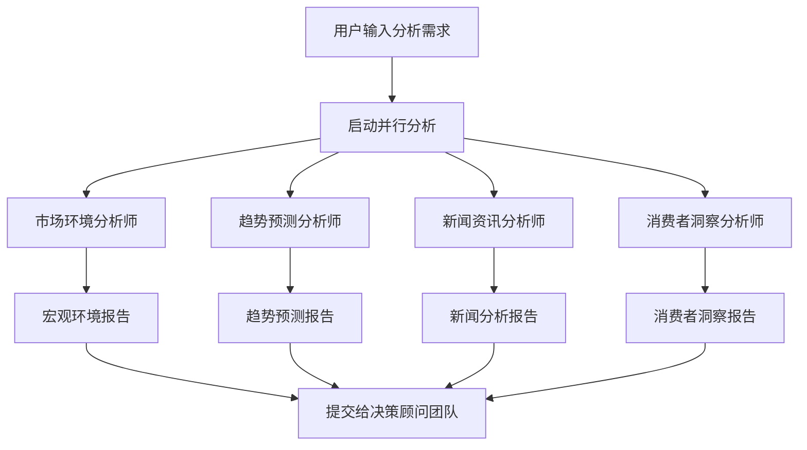

# 制造业分析师团队

## 🎯 团队概述

制造业分析师团队是系统的核心信息收集和分析单元，由4个专业化智能体组成，专注于从不同维度收集和分析影响制造业补货决策的外部信息。

### 团队特色
- **📊 并行执行**: 4个分析师同步工作，提高分析效率
- **🎯 专业分工**: 每个分析师专注特定领域，确保分析深度
- **🧠 ReAct推理**: 采用推理-行动-观察循环，保证分析质量
- **📈 数据驱动**: 基于真实外部数据，提供可靠分析结论

## 🤖 分析师团队成员

### 📊 市场环境分析师 (Market Environment Analyst)

#### 🎯 角色定位
**专业身份**: 制造业宏观经济分析专家  
**核心使命**: 分析影响制造业的宏观环境因素，为补货决策提供经济环境支撑

#### 📋 专业职责
```python
专业领域:
- PMI制造业采购经理指数分析
- PPI生产者价格指数分析
- 原材料价格波动分析
- 政策变化影响评估
- 汇率波动对制造业影响

核心能力:
- 宏观经济指标解读
- 制造业景气度判断
- 成本压力分析
- 政策影响预测
```

#### 🔧 工具配置
| 工具名称 | 用途 | 数据来源 | 更新频率 |
|---------|------|----------|----------|
| `get_manufacturing_pmi_data()` | 获取PMI指数 | TuShare Pro | 月度 |
| `get_manufacturing_ppi_data()` | 获取PPI指数 | TuShare Pro | 月度 |
| `get_manufacturing_commodity_data()` | 大宗商品价格 | TuShare Pro | 日度 |
| `query_manufacturing_knowledge()` | 专业知识查询 | RAG知识库 | 实时 |

#### 📈 分析输出
```markdown
### 制造业市场环境分析报告

**🎯 核心结论**: [一句话总结环境状况]

**📊 关键指标分析**:
- PMI指数: XX.X (环比+/-X.X)，解读：[制造业景气度评估]
- PPI指数: XX.X% (同比+/-X.X%)，解读：[成本压力分析]
- 原材料价格: [关键原材料价格变化及影响]

**🎯 对补货的影响**:
- 宏观环境: [有利/不利/中性]
- 成本压力: [上升/下降/稳定]
- 政策影响: [积极/消极/中性]

**💡 决策建议**: [基于宏观环境的补货建议]
```

### 📈 趋势预测分析师 (Trend Prediction Analyst)

#### 🎯 角色定位
**专业身份**: 需求趋势预测专家  
**核心使命**: 基于外部事件预测未来需求变化，为补货时机提供指导

#### 📋 专业职责
```python
专业领域:
- 天气预报对需求的影响
- 节假日安排对销售的影响
- 季节性需求变化预测
- 突发事件影响评估

核心能力:
- 时间序列分析
- 季节性调整
- 事件驱动分析
- 需求波动预测
```

#### 🔧 工具配置
| 工具名称 | 用途 | 数据来源 | 更新频率 |
|---------|------|----------|----------|
| `get_manufacturing_weather_data()` | 天气预报数据 | 聚合数据API | 日度 |
| `get_manufacturing_holiday_data()` | 节假日安排 | 聚合数据API | 年度 |
| `query_manufacturing_knowledge()` | 预测方法论 | RAG知识库 | 实时 |

#### 📈 分析输出
```markdown
### 制造业趋势预测分析报告

**🎯 需求趋势预测**: [上升/下降/稳定] (置信度: XX%)

**🌤️ 天气影响分析**:
- 未来一周天气: [天气概况]
- 对需求影响: [正面/负面/中性]
- 重点关注: [极端天气预警]

**🎊 节假日影响**:
- 即将到来的节假日: [节假日名称及时间]
- 历史影响分析: [需求变化幅度]
- 调整建议: [补货时机建议]

**📊 季节性分析**:
- 当前季节特征: [淡季/旺季/平季]
- 同期对比: [与去年同期对比]
- 趋势判断: [需求走势预测]

**💡 时机建议**: [最佳补货时机窗口]
```

### 📰 新闻资讯分析师 (Industry News Analyst)

#### 🎯 角色定位
**专业身份**: 行业信息监控专家  
**核心使命**: 监控行业动态和政策变化，识别影响补货决策的关键事件

#### 📋 专业职责
```python
专业领域:
- 制造业政策变化监控
- 行业重大事件分析
- 竞争对手动态跟踪
- 技术创新影响评估

核心能力:
- 信息筛选与提取
- 事件影响评估
- 趋势识别
- 风险预警
```

#### 🔧 工具配置
| 工具名称 | 用途 | 数据来源 | 更新频率 |
|---------|------|----------|----------|
| `get_manufacturing_news_data()` | 制造业新闻 | Google News | 实时 |
| `get_industry_news()` | 行业资讯 | Coze插件 | 实时 |
| `query_manufacturing_knowledge()` | 事件分析框架 | RAG知识库 | 实时 |

#### 📈 分析输出
```markdown
### 制造业新闻资讯分析报告

**📰 重要新闻摘要**:
- [新闻标题1]: [简要内容] - 影响度: ⭐⭐⭐
- [新闻标题2]: [简要内容] - 影响度: ⭐⭐
- [新闻标题3]: [简要内容] - 影响度: ⭐

**🏛️ 政策变化分析**:
- 新政策: [政策名称及内容]
- 实施时间: [生效日期]
- 影响评估: [对制造业的具体影响]
- 应对建议: [补货策略调整建议]

**🏭 行业动态**:
- 行业趋势: [当前行业发展趋势]
- 竞争态势: [主要竞争对手动态]
- 技术变化: [新技术对行业的影响]

**⚠️ 风险事件**:
- 潜在风险: [识别的风险事件]
- 发生概率: [高/中/低]
- 影响程度: [重大/中等/轻微]

**💡 应对策略**: [基于新闻分析的补货建议]
```

### 💭 消费者洞察分析师 (Consumer Insight Analyst)

#### 🎯 角色定位
**专业身份**: 市场情绪分析专家  
**核心使命**: 分析消费者情绪和行为变化，预测市场需求趋势

#### 📋 专业职责
```python
专业领域:
- 社交媒体情绪监控
- 搜索指数趋势分析
- 消费者行为模式识别
- 品牌认知度变化分析

核心能力:
- 情感分析
- 趋势识别
- 行为建模
- 需求预测
```

#### 🔧 工具配置
| 工具名称 | 用途 | 数据来源 | 更新频率 |
|---------|------|----------|----------|
| `get_manufacturing_consumer_sentiment()` | 消费者情绪 | Coze插件 | 实时 |
| `get_manufacturing_consumer_behavior()` | 消费行为 | Coze插件 | 日度 |
| `query_manufacturing_knowledge()` | 情绪分析模型 | RAG知识库 | 实时 |

#### 📈 分析输出
```markdown
### 消费者洞察分析报告

**💭 消费者情绪概况**:
- 整体情绪: [积极/中性/消极] (情绪指数: XX/100)
- 情绪变化: [相比上周 +/-X%]
- 关键词云: [热门讨论关键词]

**🔍 搜索趋势分析**:
- 搜索热度: [相关产品搜索指数]
- 趋势变化: [上升/下降/稳定]
- 地域分布: [搜索热度地域差异]

**👥 消费行为分析**:
- 购买意愿: [强烈/一般/较弱]
- 价格敏感度: [高/中/低]
- 品牌偏好: [品牌关注度排名]

**📱 社交媒体监控**:
- 讨论热度: [相关话题讨论量]
- 情感倾向: [正面/中性/负面比例]
- 影响因子: [关键意见领袖观点]

**📈 需求预测**:
- 需求强度: [强/中/弱]
- 增长预期: [预期需求变化]
- 风险提示: [需求下降风险]

**💡 洞察建议**: [基于消费者分析的补货策略]
```

## 🔄 团队协作机制

### 并行分析流程


### ReAct执行模式
每个分析师都遵循统一的ReAct推理模式：

```python
def analyst_react_cycle(self, analysis_task):
    """分析师ReAct循环"""
    
    # 1. Reasoning - 分析任务
    reasoning = self.analyze_task(analysis_task)
    
    # 2. Acting - 工具调用
    for tool_call in reasoning.tool_calls:
        data = self.execute_tool(tool_call)
        
        # 3. Observing - 观察结果
        observation = self.observe_data(data)
        
        # 判断是否需要更多数据
        if not self.has_sufficient_data(observation):
            continue
        else:
            break
    
    # 4. 生成专业报告
    return self.generate_professional_report()
```

## 🎯 质量保证机制

### 分析质量标准
1. **📊 数据支撑**: 每个结论都有具体数据支撑
2. **🧠 逻辑清晰**: 分析推理过程逻辑严密
3. **🎯 结论明确**: 避免模糊表述，提供明确建议
4. **⚠️ 风险提示**: 识别和标明分析局限性

### 报告规范
- **格式统一**: 统一的报告模板和格式
- **长度适中**: 800-1500字，重点突出
- **专业术语**: 使用准确的制造业专业术语
- **可操作性**: 提供具体的行动建议

### 错误处理
```python
class AnalystErrorHandler:
    """分析师错误处理"""
    
    def handle_data_error(self, error):
        """处理数据获取错误"""
        return self.use_fallback_data()
    
    def handle_analysis_error(self, error):
        """处理分析错误"""
        return self.regenerate_with_simplified_approach()
    
    def validate_output(self, report):
        """验证输出质量"""
        return self.check_completeness_and_accuracy(report)
```

## 📈 性能指标

### 执行效率
- **并行分析时间**: 平均15-20秒
- **单个分析师**: 平均8-12秒
- **工具调用成功率**: >95%
- **缓存命中率**: >80%

### 分析质量
- **数据覆盖率**: >90% (关键指标)
- **结论准确率**: >85% (历史验证)
- **报告完整性**: >95% (包含所有必要部分)
- **用户满意度**: >80% (基于反馈)

---

制造业分析师团队作为系统的信息收集和初步分析核心，为后续的决策制定提供了坚实的数据基础和专业洞察，确保补货决策建立在全面、准确的外部信息分析之上。
