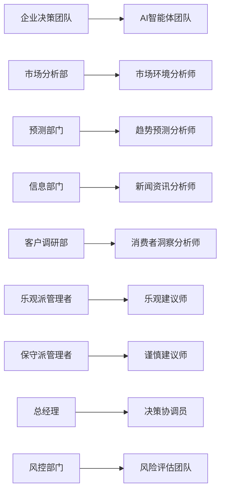

# 制造业智能体架构设计

## 🎯 设计概述

制造业智能补货决策系统采用专业化的多智能体架构，每个智能体都模拟企业内部不同职能部门的专家角色。通过ReAct推理模式和结构化的协作机制，形成一个完整的智能决策系统。

## 🧠 智能体设计哲学

### 业务映射原则


### 核心设计原则
1. **🏭 角色专业化**: 每个智能体专注特定的分析领域
2. **🤝 协作决策**: 模拟真实企业的团队决策过程
3. **🧠 ReAct推理**: 推理-行动-观察的智能循环
4. **📊 数据驱动**: 基于真实外部数据的专业分析

## 🤖 智能体分类与架构

### 第一层：并行分析师团队
**执行模式**: 并行执行，独立分析
**职责**: 从不同维度收集和分析外部信息

#### 📊 市场环境分析师 (Market Environment Analyst)
```python
class MarketEnvironmentAnalyst(BaseAgent):
    """市场环境分析师 - 宏观指标分析专家"""
    
    专业领域:
    - PMI制造业采购经理指数分析
    - PPI生产者价格指数分析  
    - 原材料价格波动分析
    - 政策变化影响评估
    - 汇率波动对制造业影响
    
    核心工具:
    - get_manufacturing_pmi_data()
    - get_manufacturing_ppi_data() 
    - get_manufacturing_commodity_data()
    
    分析输出:
    - 宏观经济指标评估
    - 制造业景气度分析
    - 成本压力预警
    - 政策影响预测
```

#### 📈 趋势预测分析师 (Trend Prediction Analyst)
```python
class TrendPredictionAnalyst(BaseAgent):
    """趋势预测分析师 - 未来事件预测专家"""
    
    专业领域:
    - 天气预报对需求的影响
    - 节假日安排对销售的影响
    - 季节性需求变化预测
    - 突发事件影响评估
    
    核心工具:
    - get_manufacturing_weather_data()
    - get_manufacturing_holiday_data()
    - query_manufacturing_knowledge()
    
    分析输出:
    - 需求趋势预测
    - 季节性调整建议
    - 事件驱动影响分析
    - 时间窗口优化建议
```

#### 📰 新闻资讯分析师 (Industry News Analyst)
```python
class IndustryNewsAnalyst(BaseAgent):
    """新闻资讯分析师 - 行业信息监控专家"""
    
    专业领域:
    - 制造业政策变化监控
    - 行业重大事件分析
    - 竞争对手动态跟踪
    - 技术创新影响评估
    
    核心工具:
    - get_manufacturing_news_data()
    - get_industry_news()
    - query_manufacturing_knowledge()
    
    分析输出:
    - 政策影响分析
    - 行业趋势报告
    - 竞争环境评估
    - 风险事件预警
```

#### 💭 消费者洞察分析师 (Consumer Insight Analyst)
```python
class ConsumerInsightAnalyst(BaseAgent):
    """消费者洞察分析师 - 市场情绪分析专家"""
    
    专业领域:
    - 社交媒体情绪监控
    - 搜索指数趋势分析
    - 消费者行为模式识别
    - 品牌认知度变化分析
    
    核心工具:
    - get_manufacturing_consumer_sentiment()
    - get_manufacturing_consumer_behavior()
    - query_manufacturing_knowledge()
    
    分析输出:
    - 消费者情绪评估
    - 品牌认知度分析
    - 购买意愿预测
    - 市场口碑监控
```

### 第二层：决策顾问团队
**执行模式**: 辩论式决策，对抗性分析
**职责**: 基于分析师报告提供不同角度的决策建议

#### 😊 乐观建议师 (Optimistic Advisor)
```python
class OptimisticAdvisor(BaseAgent):
    """乐观建议师 - 机会识别专家"""
    
    分析视角:
    - 积极因素挖掘
    - 增长机会识别
    - 市场扩张可能性
    - 竞争优势分析
    
    输出特点:
    - 强调积极趋势
    - 建议增加补货
    - 突出市场机会
    - 提供增长策略
```

#### 😐 谨慎建议师 (Cautious Advisor)
```python
class CautiousAdvisor(BaseAgent):
    """谨慎建议师 - 风险识别专家"""
    
    分析视角:
    - 风险因素识别
    - 不确定性评估
    - 下行风险分析
    - 保守策略建议
    
    输出特点:
    - 强调风险因素
    - 建议谨慎补货
    - 突出不确定性
    - 提供风控策略
```

### 第三层：决策协调层
**执行模式**: 单点决策，综合整合
**职责**: 整合各方意见，制定最终决策方案

#### 🎯 决策协调员 (Decision Coordinator)
```python
class DecisionCoordinator(BaseAgent):
    """决策协调员 - 综合决策制定者"""
    
    核心职责:
    - 整合分析师报告
    - 协调顾问分歧
    - 权重分配决策
    - 最终方案制定
    
    决策逻辑:
    - 数据一致性验证
    - 关键因素识别
    - 趋势方向判断
    - 明确补货建议
    
    输出格式:
    - 明确方向建议（增加/维持/减少）
    - 具体幅度建议（百分比）
    - 置信度评估
    - 执行时机建议
```

### 第四层：风险管控层
**执行模式**: 最终审核，风险评估
**职责**: 全面风险评估，提供最终建议

#### 🛡️ 风险评估团队 (Risk Assessment Team)
```python
class RiskAssessmentTeam(BaseAgent):
    """风险评估团队 - 最终风险把关者"""
    
    评估维度:
    - 供应链风险
    - 财务风险
    - 市场风险
    - 运营风险
    
    输出内容:
    - 综合风险等级
    - 关键风险因素
    - 缓解措施建议
    - 监控指标设定
```

## 🔄 智能体协作流程

### ReAct工作流设计
```mermaid
sequenceDiagram
    participant User as 用户输入
    participant MEA as 市场环境分析师
    participant TPA as 趋势预测分析师
    participant INA as 新闻分析师
    participant CIA as 消费者分析师
    participant OPT as 乐观建议师
    participant CAU as 谨慎建议师
    participant COORD as 决策协调员
    participant RISK as 风险评估团队

    User->>MEA: 1. 启动分析
    User->>TPA: 1. 启动分析
    User->>INA: 1. 启动分析  
    User->>CIA: 1. 启动分析

    par 并行分析阶段
        MEA->>MEA: ReAct: 推理→工具调用→观察
        TPA->>TPA: ReAct: 推理→工具调用→观察
        INA->>INA: ReAct: 推理→工具调用→观察
        CIA->>CIA: ReAct: 推理→工具调用→观察
    end

    MEA->>OPT: 2. 提交市场环境报告
    TPA->>OPT: 2. 提交趋势预测报告
    INA->>CAU: 2. 提交新闻分析报告
    CIA->>CAU: 2. 提交消费者洞察报告

    par 决策顾问辩论
        OPT->>OPT: 乐观分析与建议
        CAU->>CAU: 谨慎分析与建议
    end

    OPT->>COORD: 3. 乐观建议
    CAU->>COORD: 3. 谨慎建议
    
    COORD->>COORD: 4. 综合决策制定
    COORD->>RISK: 5. 决策方案提交
    
    RISK->>RISK: 6. 风险评估
    RISK->>User: 7. 最终补货建议
```

### 状态管理机制
```python
class ManufacturingState(TypedDict):
    """制造业智能体状态定义"""
    
    # 基础信息
    city_name: str                       # 目标城市
    product_type: str                    # 产品类型
    company_name: str                    # 公司名称
    target_quarter: str                  # 目标季度
    
    # 分析报告
    market_environment_report: str       # 市场环境分析
    trend_prediction_report: str         # 趋势预测分析
    industry_news_report: str           # 行业新闻分析
    consumer_insight_report: str        # 消费者洞察
    
    # 决策过程
    decision_debate_state: Dict[str, Any] # 决策辩论状态
    decision_coordination_plan: str      # 决策协调方案
    final_replenishment_decision: str    # 最终补货决策
    risk_assessment_report: str          # 风险评估报告
    
    # 结构化输出
    conclusion_json: Dict[str, Any]      # 结构化结论
    confidence_score: float              # 置信度评分
    risk_level: str                     # 风险等级
```

## 🔧 ReAct推理模式实现

### 基础ReAct循环
```python
def react_cycle(self, query: str, tools: List[Tool]) -> str:
    """ReAct推理循环"""
    
    # 1. Reasoning - 分析当前情况
    reasoning = self.llm.invoke(f"""
    基于当前任务：{query}
    我需要思考：
    1. 需要获取什么数据？
    2. 应该使用哪些工具？
    3. 数据获取后如何分析？
    """)
    
    # 2. Acting - 执行工具调用
    for tool_call in reasoning.tool_calls:
        tool_result = self.execute_tool(tool_call, tools)
        
        # 3. Observing - 观察结果
        observation = self.llm.invoke(f"""
        工具调用结果：{tool_result}
        基于这个结果，我观察到：
        1. 数据是否符合预期？
        2. 需要进一步获取什么信息？
        3. 可以得出什么初步结论？
        """)
        
        # 决定是否继续循环
        if self.should_continue(observation):
            continue
        else:
            break
    
    # 4. 生成最终分析报告
    return self.generate_final_report()
```

### 工具调用机制
```python
class ManufacturingToolCall:
    """制造业工具调用封装"""
    
    def __init__(self, agent_role: str, toolkit: ManufacturingToolkit):
        self.agent_role = agent_role
        self.toolkit = toolkit
        self.call_history = []
    
    def execute_tool(self, tool_name: str, params: Dict) -> Dict:
        """执行工具调用"""
        try:
            # 记录调用历史
            self.call_history.append({
                "tool": tool_name,
                "params": params,
                "timestamp": datetime.now()
            })
            
            # 执行工具
            result = getattr(self.toolkit, tool_name)(**params)
            
            # 缓存结果
            self.cache_result(tool_name, params, result)
            
            return result
            
        except Exception as e:
            return {"error": str(e), "fallback": self.get_fallback_data()}
```

## 🎯 智能体专业化配置

### 分析师专业化配置
```python
ANALYST_CONFIGS = {
    "market_environment_analyst": {
        "llm_model": "qwen-plus",
        "temperature": 0.1,
        "max_tokens": 2000,
        "primary_tools": ["pmi_tool", "ppi_tool", "commodity_tool"],
        "secondary_tools": ["news_tool", "knowledge_tool"],
        "expertise": ["宏观经济", "制造业指标", "政策分析"],
        "analysis_depth": "深度分析",
        "report_style": "数据导向"
    },
    
    "trend_prediction_analyst": {
        "llm_model": "qwen-plus", 
        "temperature": 0.2,
        "max_tokens": 1800,
        "primary_tools": ["weather_tool", "holiday_tool"],
        "secondary_tools": ["knowledge_tool"],
        "expertise": ["需求预测", "季节性分析", "事件驱动"],
        "analysis_depth": "趋势分析",
        "report_style": "预测导向"
    }
}
```

### 决策层配置
```python
DECISION_CONFIGS = {
    "optimistic_advisor": {
        "llm_model": "qwen-max",
        "temperature": 0.3,
        "perspective": "积极乐观",
        "focus": ["机会识别", "增长潜力", "竞争优势"],
        "bias": "倾向增加补货"
    },
    
    "cautious_advisor": {
        "llm_model": "qwen-max",
        "temperature": 0.1,
        "perspective": "谨慎保守", 
        "focus": ["风险识别", "不确定性", "损失控制"],
        "bias": "倾向减少补货"
    }
}
```

## 📊 协作机制设计

### 信息传递协议
```python
class AgentMessage:
    """智能体间消息格式"""
    
    sender: str              # 发送者
    receiver: str            # 接收者
    message_type: str        # 消息类型
    content: Dict           # 消息内容
    priority: int           # 优先级
    timestamp: datetime     # 时间戳
    
    @classmethod
    def create_analysis_report(cls, sender: str, report: str) -> 'AgentMessage':
        """创建分析报告消息"""
        return cls(
            sender=sender,
            receiver="decision_coordinator", 
            message_type="analysis_report",
            content={"report": report},
            priority=1
        )
```

### 决策收敛机制
```python
class DecisionConvergence:
    """决策收敛算法"""
    
    def converge_advisor_opinions(self, optimistic: str, cautious: str) -> str:
        """收敛顾问意见"""
        
        # 提取关键观点
        opt_points = self.extract_key_points(optimistic)
        cau_points = self.extract_key_points(cautious)
        
        # 识别共识和分歧
        consensus = self.find_consensus(opt_points, cau_points)
        disagreements = self.find_disagreements(opt_points, cau_points)
        
        # 生成平衡建议
        return self.generate_balanced_recommendation(consensus, disagreements)
```

## 🛡️ 质量保证机制

### 输出质量控制
```python
class QualityController:
    """智能体输出质量控制"""
    
    def validate_analysis_report(self, report: str, agent_type: str) -> bool:
        """验证分析报告质量"""
        
        checks = [
            self.check_data_support(report),      # 数据支撑检查
            self.check_logical_consistency(report), # 逻辑一致性
            self.check_professional_terminology(report), # 专业术语
            self.check_conclusion_clarity(report)  # 结论清晰度
        ]
        
        return all(checks)
    
    def enhance_report_quality(self, report: str) -> str:
        """提升报告质量"""
        if not self.validate_analysis_report(report):
            return self.regenerate_with_feedback(report)
        return report
```

## 📈 性能优化策略

### 并行执行优化
- **分析师并行**: 4个分析师同时执行，减少总耗时
- **工具调用优化**: 智能缓存，避免重复API调用
- **模型选择**: 根据任务复杂度选择合适的LLM模型

### 成本控制
- **模型分层**: 简单任务用轻量模型，复杂决策用高级模型
- **Token优化**: 精简提示词，减少不必要的Token消耗
- **缓存策略**: 缓存常用数据和分析结果

---

通过这种专业化、协作化的智能体架构，制造业智能补货决策系统实现了从数据分析到最终决策的完整链路，每个智能体都具备明确的职责和专业能力，确保了决策的准确性和可靠性。
