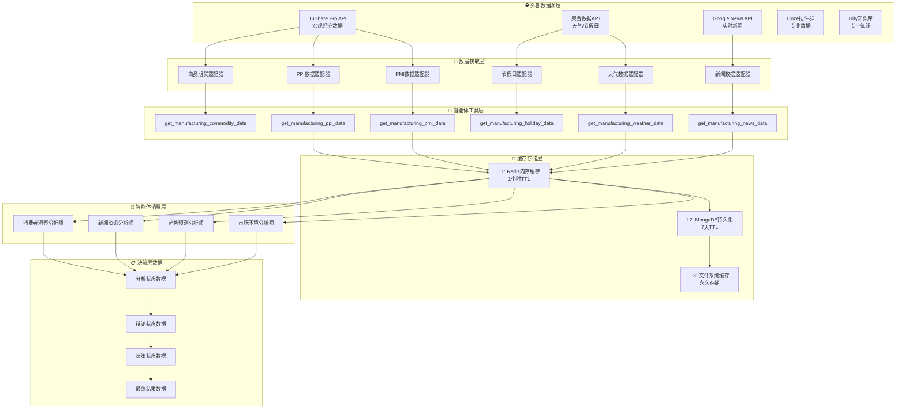
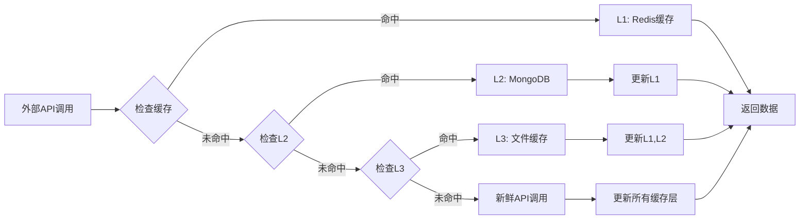
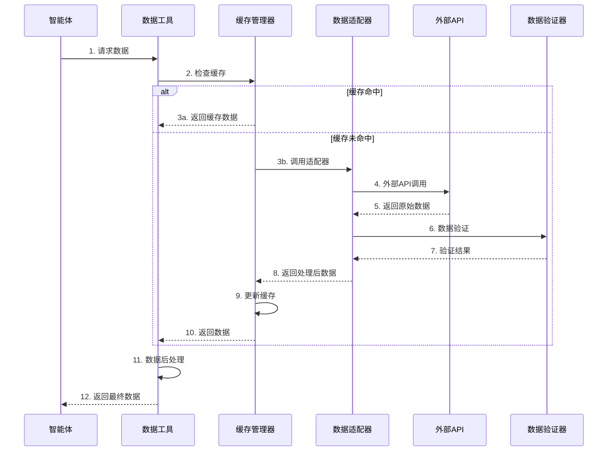

# 制造业数据流架构

## 🎯 数据流概述

制造业智能补货决策系统的数据流架构设计了从外部数据源到最终决策输出的完整数据处理链路，确保数据的实时性、准确性和可靠性。

### 核心设计原则
- **🔄 多源融合**: 集成多个外部数据源，提供全面信息视角
- **⚡ 实时处理**: 支持实时数据获取和处理，快速响应市场变化
- **🛡️ 容错设计**: 多层降级机制，确保在数据源故障时系统稳定运行
- **📊 智能缓存**: 三层缓存架构，平衡性能和数据新鲜度

## 🏗️ 整体数据流架构



## 📊 数据源详细设计

### 1. TuShare Pro API
**数据类型**: 宏观经济指标  
**更新频率**: 日度/月度  
**主要数据**:

| 数据项 | API接口 | 更新频率 | 用途 |
|--------|---------|----------|------|
| PMI指数 | `pro_api.eco_cal()` | 月度 | 制造业景气度分析 |
| PPI指数 | `pro_api.eco_cal()` | 月度 | 生产者价格趋势 |
| 工业增加值 | `pro_api.eco_cal()` | 月度 | 工业生产水平 |
| 期货价格 | `pro_api.fut_daily()` | 日度 | 原材料成本预测 |

```python
class TuShareDataAdapter:
    """TuShare数据适配器"""
    
    def get_pmi_data(self, start_date: str, end_date: str) -> Dict:
        """获取PMI数据"""
        try:
            # 调用TuShare API
            df = self.pro_api.eco_cal(
                start_date=start_date,
                end_date=end_date,
                event='制造业PMI'
            )
            
            return {
                "success": True,
                "data": df.to_dict('records'),
                "timestamp": datetime.now().isoformat(),
                "source": "tushare_pro"
            }
        except Exception as e:
            return self._handle_error(e, "pmi_data")
    
    def get_ppi_data(self, start_date: str, end_date: str) -> Dict:
        """获取PPI数据"""
        try:
            df = self.pro_api.eco_cal(
                start_date=start_date,
                end_date=end_date,
                event='PPI同比'
            )
            
            return {
                "success": True,
                "data": df.to_dict('records'),
                "timestamp": datetime.now().isoformat(),
                "source": "tushare_pro"
            }
        except Exception as e:
            return self._handle_error(e, "ppi_data")
```

### 2. 聚合数据API
**数据类型**: 天气和节假日信息  
**更新频率**: 实时/年度  
**主要数据**:

| 数据项 | API接口 | 更新频率 | 用途 |
|--------|---------|----------|------|
| 天气预报 | `/weather/forecast` | 实时 | 需求影响分析 |
| 历史天气 | `/weather/history` | 日度 | 季节性分析 |
| 节假日安排 | `/holiday/list` | 年度 | 消费高峰预测 |

```python
class JuHeDataAdapter:
    """聚合数据适配器"""
    
    def get_weather_forecast(self, city: str, days: int = 7) -> Dict:
        """获取天气预报"""
        try:
            response = requests.get(
                f"{self.base_url}/weather/forecast",
                params={
                    "cityname": city,
                    "days": days,
                    "key": self.api_key
                }
            )
            
            data = response.json()
            
            return {
                "success": True,
                "data": data.get("result", {}),
                "timestamp": datetime.now().isoformat(),
                "source": "juhe_api"
            }
        except Exception as e:
            return self._handle_error(e, "weather_forecast")
    
    def get_holiday_list(self, year: int) -> Dict:
        """获取节假日列表"""
        try:
            response = requests.get(
                f"{self.base_url}/holiday/list",
                params={
                    "year": year,
                    "key": self.api_key
                }
            )
            
            data = response.json()
            
            return {
                "success": True,
                "data": data.get("result", {}),
                "timestamp": datetime.now().isoformat(),
                "source": "juhe_api"
            }
        except Exception as e:
            return self._handle_error(e, "holiday_list")
```

### 3. Google News API
**数据类型**: 实时新闻资讯  
**更新频率**: 实时  
**主要功能**: 制造业相关新闻监控

```python
class GoogleNewsAdapter:
    """Google新闻数据适配器"""
    
    def get_manufacturing_news(self, 
                             keywords: str, 
                             language: str = "zh",
                             max_results: int = 20) -> Dict:
        """获取制造业新闻"""
        try:
            from pygooglenews import GoogleNews
            
            gn = GoogleNews(lang=language, country='CN')
            search_result = gn.search(keywords)
            
            # 解析新闻数据
            news_items = []
            for item in search_result['entries'][:max_results]:
                news_items.append({
                    "title": item.get("title", ""),
                    "link": item.get("link", ""),
                    "published": item.get("published", ""),
                    "summary": item.get("summary", ""),
                    "source": item.get("source", {}).get("title", "")
                })
            
            return {
                "success": True,
                "data": news_items,
                "timestamp": datetime.now().isoformat(),
                "source": "google_news"
            }
        except Exception as e:
            return self._handle_error(e, "manufacturing_news")
```

## 🛡️ 三层缓存架构

### 缓存层次设计


### 缓存策略实现
```python
class CacheManager:
    """三层缓存管理器"""
    
    def __init__(self):
        self.redis_client = redis.Redis(...)
        self.mongo_client = pymongo.MongoClient(...)
        self.file_cache_path = "./cache"
    
    def get_cached_data(self, cache_key: str) -> Optional[Dict]:
        """按层次获取缓存数据"""
        
        # L1: Redis内存缓存
        l1_data = self._get_from_redis(cache_key)
        if l1_data:
            self._record_cache_hit("L1", cache_key)
            return l1_data
        
        # L2: MongoDB持久化
        l2_data = self._get_from_mongodb(cache_key)
        if l2_data:
            self._record_cache_hit("L2", cache_key)
            # 回填L1缓存
            self._set_to_redis(cache_key, l2_data, ttl=3600)
            return l2_data
        
        # L3: 文件系统缓存
        l3_data = self._get_from_file(cache_key)
        if l3_data:
            self._record_cache_hit("L3", cache_key)
            # 回填L1, L2缓存
            self._set_to_redis(cache_key, l3_data, ttl=3600)
            self._set_to_mongodb(cache_key, l3_data)
            return l3_data
        
        self._record_cache_miss(cache_key)
        return None
    
    def set_cached_data(self, cache_key: str, data: Dict):
        """设置缓存数据到所有层次"""
        
        # 同时更新所有缓存层
        self._set_to_redis(cache_key, data, ttl=3600)  # 1小时
        self._set_to_mongodb(cache_key, data)  # 7天TTL
        self._set_to_file(cache_key, data)  # 永久存储
    
    def _get_from_redis(self, key: str) -> Optional[Dict]:
        """从Redis获取数据"""
        try:
            data = self.redis_client.get(key)
            return json.loads(data) if data else None
        except Exception as e:
            logger.warning(f"Redis缓存获取失败: {e}")
            return None
    
    def _get_from_mongodb(self, key: str) -> Optional[Dict]:
        """从MongoDB获取数据"""
        try:
            collection = self.mongo_client.cache.manufacturing_data
            doc = collection.find_one({"_id": key})
            
            if doc and doc.get("expires_at") > datetime.now():
                return doc.get("data")
            return None
        except Exception as e:
            logger.warning(f"MongoDB缓存获取失败: {e}")
            return None
```

## 🔄 数据处理流程

### 端到端数据流


### 数据验证机制
```python
class DataValidator:
    """数据验证器"""
    
    def validate_pmi_data(self, data: Dict) -> Tuple[bool, List[str]]:
        """验证PMI数据"""
        errors = []
        
        # 检查必要字段
        required_fields = ["date", "value", "previous_value"]
        for field in required_fields:
            if field not in data:
                errors.append(f"缺少必要字段: {field}")
        
        # 检查数值范围
        if "value" in data:
            value = data["value"]
            if not (0 <= value <= 100):
                errors.append(f"PMI值超出有效范围[0,100]: {value}")
        
        # 检查时间有效性
        if "date" in data:
            try:
                datetime.strptime(data["date"], "%Y-%m-%d")
            except ValueError:
                errors.append(f"无效的日期格式: {data['date']}")
        
        return len(errors) == 0, errors
    
    def validate_weather_data(self, data: Dict) -> Tuple[bool, List[str]]:
        """验证天气数据"""
        errors = []
        
        # 检查温度范围
        if "temperature" in data:
            temp = data["temperature"]
            if not (-50 <= temp <= 60):
                errors.append(f"温度超出合理范围: {temp}°C")
        
        # 检查湿度范围
        if "humidity" in data:
            humidity = data["humidity"]
            if not (0 <= humidity <= 100):
                errors.append(f"湿度超出有效范围: {humidity}%")
        
        return len(errors) == 0, errors
```

## 📈 数据质量监控

### 数据质量指标
```python
class DataQualityMonitor:
    """数据质量监控器"""
    
    def __init__(self):
        self.metrics = {
            "api_success_rate": 0.0,
            "data_completeness": 0.0,
            "data_freshness": 0.0,
            "cache_hit_rate": 0.0
        }
    
    def calculate_api_success_rate(self) -> float:
        """计算API成功率"""
        total_calls = self._get_total_api_calls()
        successful_calls = self._get_successful_api_calls()
        return successful_calls / max(total_calls, 1)
    
    def calculate_data_completeness(self) -> float:
        """计算数据完整性"""
        expected_fields = self._get_expected_field_count()
        actual_fields = self._get_actual_field_count()
        return actual_fields / max(expected_fields, 1)
    
    def calculate_data_freshness(self) -> float:
        """计算数据新鲜度"""
        current_time = datetime.now()
        data_timestamps = self._get_data_timestamps()
        
        if not data_timestamps:
            return 0.0
        
        avg_age = sum(
            (current_time - ts).total_seconds() 
            for ts in data_timestamps
        ) / len(data_timestamps)
        
        # 转换为新鲜度评分 (24小时内为1.0，线性衰减)
        return max(0.0, 1.0 - (avg_age / 86400))  # 86400秒 = 24小时
```

### 异常检测与处理
```python
class AnomalyDetector:
    """数据异常检测器"""
    
    def detect_pmi_anomaly(self, current_value: float, historical_values: List[float]) -> bool:
        """检测PMI数据异常"""
        if len(historical_values) < 3:
            return False
        
        # 计算统计指标
        mean = statistics.mean(historical_values)
        std_dev = statistics.stdev(historical_values)
        
        # 3-sigma规则检测异常
        z_score = abs(current_value - mean) / max(std_dev, 0.1)
        return z_score > 3.0
    
    def detect_data_staleness(self, data_timestamp: datetime, threshold_hours: int = 24) -> bool:
        """检测数据过期"""
        current_time = datetime.now()
        age_hours = (current_time - data_timestamp).total_seconds() / 3600
        return age_hours > threshold_hours
```

## 🚀 性能优化策略

### 1. 并发数据获取
```python
import asyncio
import aiohttp

class ConcurrentDataFetcher:
    """并发数据获取器"""
    
    async def fetch_all_data(self, data_requests: List[Dict]) -> Dict:
        """并发获取所有数据"""
        tasks = []
        
        for request in data_requests:
            task = self._create_fetch_task(request)
            tasks.append(task)
        
        results = await asyncio.gather(*tasks, return_exceptions=True)
        
        # 整理结果
        return self._process_concurrent_results(results, data_requests)
    
    async def _create_fetch_task(self, request: Dict):
        """创建单个获取任务"""
        data_type = request["type"]
        params = request["params"]
        
        if data_type == "pmi":
            return await self._fetch_pmi_data(**params)
        elif data_type == "weather":
            return await self._fetch_weather_data(**params)
        # ... 其他数据类型
```

### 2. 智能预取策略
```python
class DataPrefetcher:
    """数据预取器"""
    
    def predict_data_needs(self, analysis_patterns: List[str]) -> List[str]:
        """预测数据需求"""
        predicted_needs = []
        
        # 基于历史分析模式预测
        for pattern in analysis_patterns:
            if "market_environment" in pattern:
                predicted_needs.extend(["pmi_data", "ppi_data"])
            if "trend_prediction" in pattern:
                predicted_needs.extend(["weather_data", "holiday_data"])
        
        return list(set(predicted_needs))  # 去重
    
    def prefetch_data(self, predicted_needs: List[str]):
        """预取数据"""
        for data_type in predicted_needs:
            if not self._is_cached(data_type):
                self._schedule_prefetch(data_type)
```

## 📊 监控与告警

### 性能指标监控
- **API响应时间**: 平均<2秒，P95<5秒
- **缓存命中率**: L1>80%, L2>60%, L3>40%
- **数据新鲜度**: >95%数据在24小时内
- **API成功率**: >99%

### 告警机制
```python
class AlertManager:
    """告警管理器"""
    
    def check_data_quality_alerts(self):
        """检查数据质量告警"""
        
        # API成功率告警
        if self.monitor.get_api_success_rate() < 0.95:
            self._send_alert("API成功率过低", "critical")
        
        # 缓存命中率告警
        if self.monitor.get_cache_hit_rate() < 0.7:
            self._send_alert("缓存命中率过低", "warning")
        
        # 数据新鲜度告警
        if self.monitor.get_data_freshness() < 0.9:
            self._send_alert("数据不够新鲜", "warning")
```

---

通过这种精心设计的数据流架构，制造业智能补货决策系统确保了数据的高质量、高可用性和高性能，为智能体团队提供了可靠的数据基础，支撑整个决策分析流程的顺利运行。
