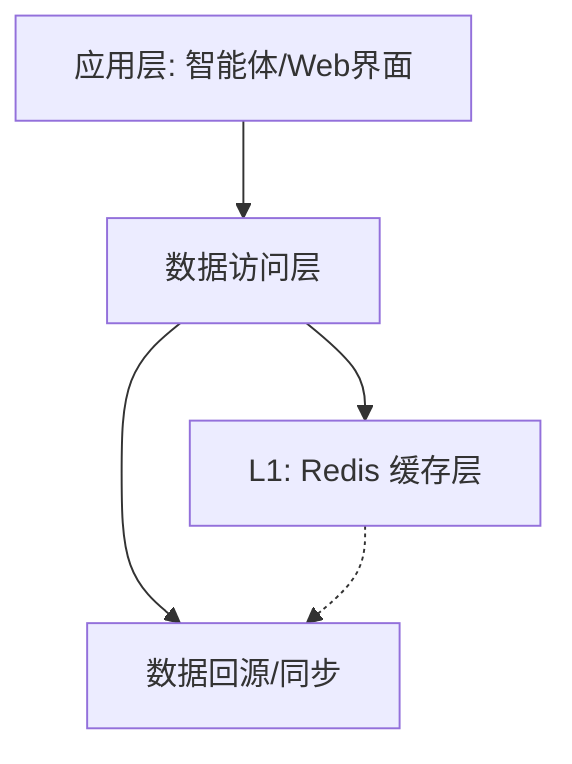
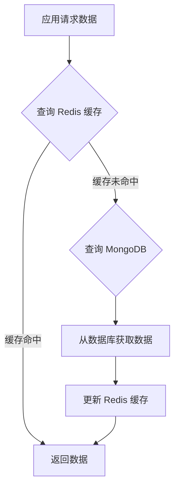
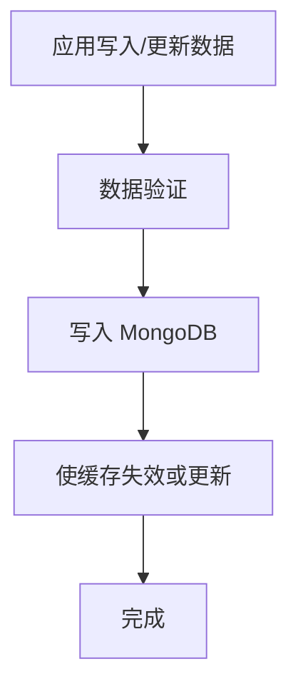

# 制造业智能补货决策系统 - 数据库架构设计

## 1. 概述

本文档旨在详细阐述“制造业智能补货决策系统”的数据库架构。该设计融合了 MongoDB 和 Redis，构建了一个既能支撑高并发实时查询，又具备灵活数据存储能力的高性能数据管理平台，为多智能体决策分析提供坚实的数据基础。

## 2. 架构概览

系统采用分层数据架构，以实现性能与灵活性的平衡。



| 组件 | 角色 | 主要职责 |
|---|---|---|
| **Redis** | **高速缓存层 (L1)** | 存储高频访问的热数据，提供毫秒级响应，降低数据库压力。 |
| **MongoDB** | **持久化存储层 (L2)** | 存储全量业务数据、分析结果及配置信息，利用其灵活的文档模型。 |
| **数据访问层** | **统一接口** | 封装底层数据操作，提供统一的数据访问API，并内置缓存管理逻辑。 |

---

## 3. MongoDB 数据模型设计

### 3.1 核心集合 (Collections)

| 集合名称 | 用途说明 | 示例字段 |
|---|---|---|
| `products` | 存储产品基础信息 | `product_id`, `name`, `category`, `cost` |
| `inventory_data` | 记录实时库存与历史数据 | `product_id`, `warehouse_id`, `quantity`, `timestamp` |
| `supplier_data` | 管理供应商信息 | `supplier_id`, `name`, `lead_time`, `reliability_score` |
| `market_data` | 存储外部市场与宏观数据 | `indicator_name` (e.g., PMI), `value`, `date` |
| `analysis_reports` | 保存智能体生成的分析报告 | `report_id`, `product_id`, `created_at`, `content`, `risk_level` |
| `system_configs` | 存放系统级配置 | `config_key`, `value`, `description` |

### 3.2 索引策略

为保障查询效率，关键集合设计了如下索引：

| 集合 | 索引 | 目的 |
|---|---|---|
| `products` | `{ "product_id": 1 }` | 快速按产品ID查找。 |
| `inventory_data` | `{ "product_id": 1, "timestamp": -1 }` | 快速获取指定产品的最新库存。 |
| `supplier_data` | `{ "supplier_id": 1 }` | 快速按供应商ID查找。 |
| `analysis_reports` | `{ "product_id": 1, "created_at": -1 }` | 快速查询产品的最新分析报告。 |

### 3.3 文档模型示例

```json
// `inventory_data` 集合示例文档
{
  "_id": ObjectId("..."),
  "product_id": "P001",
  "product_name": "电子芯片-CPU",
  "warehouse_id": "WH-EAST-01",
  "quantity": 5200,
  "unit": "pieces",
  "timestamp": ISODate("2023-10-26T10:00:00Z"),
  "source": "wms_system"
}

// `analysis_reports` 集合示例文档
{
  "_id": ObjectId("..."),
  "report_id": "REP-P001-20231026-1",
  "product_id": "P001",
  "created_at": ISODate("2023-10-26T11:30:00Z"),
  "decision_summary": {
    "recommended_action": "REPLENISH",
    "quantity": 1500,
    "confidence_score": 0.85,
    "risk_level": "MEDIUM"
  },
  "full_content_ref": "file_storage/reports/REP-P001-....md"
}
```

---

## 4. Redis 缓存设计

### 4.1 键空间设计

采用统一前缀 `mfg:` (manufacturing) 来组织缓存键。

| 键模式 | 数据类型 | TTL | 用途 |
|---|---|---|---|
| `mfg:product:{product_id}` | Hash | 24h | 缓存单个产品的详细信息。 |
| `mfg:inventory:latest:{product_id}`| String (JSON) | 1h | 缓存产品的最新库存状态。 |
| `mfg:market_data:{indicator}` | String (JSON) | 6h | 缓存最新的宏观经济指标。 |
| `mfg:supplier:{supplier_id}` | Hash | 24h | 缓存供应商信息。 |
| `mfg:report:latest:{product_id}` | String (JSON) | 4h | 缓存产品的最新分析报告摘要。 |
| `mfg:lock:{resource_name}` | String | 30s | 用于数据更新或分析任务的分布式锁。 |

### 4.2 数据结构示例

```sh
# 缓存产品信息 (Hash)
HSET mfg:product:P001 name "电子芯片-CPU" cost 120.5 category "Electronics"
EXPIRE mfg:product:P001 86400

# 缓存最新库存 (String)
SET mfg:inventory:latest:P001 '{"quantity": 5200, "timestamp": "2023-10-26T10:00:00Z"}'
EXPIRE mfg:inventory:latest:P001 3600

# 分布式锁
SET mfg:lock:update_inventory_P001 <unique_lock_id> NX EX 30
```

---

## 5. 数据流转机制

### 5.1 数据读取流程


1.  **优先查询Redis**：应用层首先向Redis请求数据。
2.  **缓存命中**：如果数据在Redis中存在，则直接返回，流程结束。
3.  **缓存未命中**：如果Redis中不存在，则向MongoDB发起查询。
4.  **数据回源与缓存更新**：从MongoDB获取数据后，将其写入Redis缓存（设置TTL），然后再返回给应用层。

### 5.2 数据写入/更新流程


1.  **写入数据库**：数据首先被写入MongoDB进行持久化。
2.  **缓存处理**：根据业务场景，选择合适的缓存处理策略：
    *   **更新缓存**：将新数据直接写入缓存。
    *   **删除缓存（失效）**：从缓存中删除旧数据，等待下次读取时再加载。对于不频繁更新的数据，此策略更简单高效。

---

## 6. 部署与维护

### 6.1 部署建议
- **开发/测试环境**: 可使用 Docker Compose 将 MongoDB 和 Redis 作为容器化服务快速启动。
- **生产环境**:
    - **MongoDB**: 推荐使用副本集（Replica Set）以实现高可用性。
    - **Redis**: 可配置主从复制（Master-Slave）和哨兵（Sentinel）机制，保障服务的高可用。

### 6.2 维护要点
- **监控**: 对数据库和缓存的关键性能指标（如查询延迟、内存使用率、缓存命中率）进行持续监控。
- **备份**: 定期对 MongoDB 进行数据备份（如每日快照）。
- **索引维护**: 定期审查慢查询日志，优化或调整索引。

此数据库架构旨在为“制造业智能补货决策系统”提供一个稳定、高效且可扩展的数据基础，有力支撑其复杂的AI分析任务。