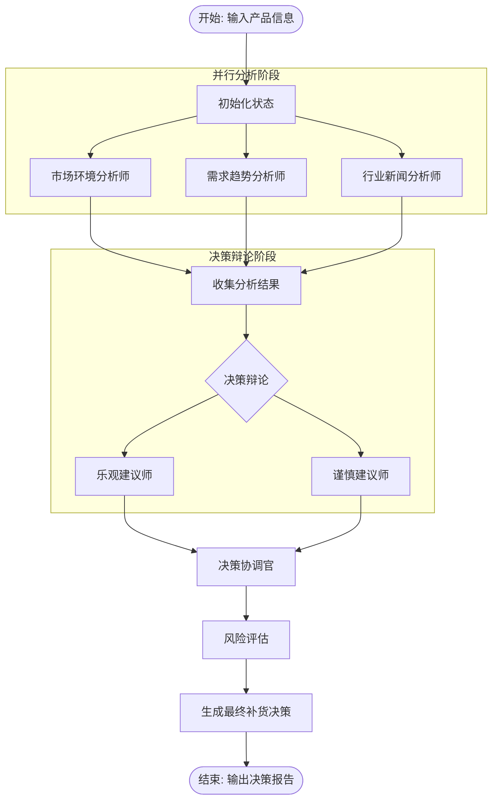

# LangGraph 图结构设计

## 1. 概述

本系统基于 LangGraph 框架构建，通过有向无环图（DAG）的形式来组织和编排多个智能体的工作流程。这种设计确保了从数据分析到最终补货决策的整个过程条理清晰、信息流转顺畅，并支持复杂的协作与条件逻辑。

## 2. 整体工作流图



## 3. 核心组件设计

### 3.1 图构建器 (`GraphBuilder`)

`GraphBuilder` 负责定义和连接图中的所有节点和边。

```python
from langgraph.graph import StateGraph, END
from .state import ManufacturingState

class GraphBuilder:
    def __init__(self, agent_factory):
        self.agent_factory = agent_factory

    def build_graph(self) -> StateGraph:
        """构建并编译制造业决策的StateGraph"""
        workflow = StateGraph(ManufacturingState)

        # 1. 添加分析节点
        workflow.add_node("market_environment_analyst", self.run_analyst)
        workflow.add_node("trend_prediction_analyst", self.run_analyst)
        workflow.add_node("industry_news_analyst", self.run_analyst)

        # 2. 添加决策与评估节点
        workflow.add_node("decision_coordinator", self.run_coordinator)
        workflow.add_node("risk_assessor", self.run_risk_assessor)

        # 3. 设置图的入口
        workflow.set_entry_point("market_environment_analyst") # Can start with any analyst

        # 4. 定义边的连接关系
        # 并行分析后进入决策协调
        workflow.add_edge("market_environment_analyst", "decision_coordinator")
        workflow.add_edge("trend_prediction_analyst", "decision_coordinator")
        workflow.add_edge("industry_news_analyst", "decision_coordinator")
        
        # 决策协调后进行风险评估
        workflow.add_edge("decision_coordinator", "risk_assessor")
        
        # 风险评估后结束
        workflow.add_edge("risk_assessor", END)

        return workflow.compile()

    def run_analyst(self, state: ManufacturingState, agent_name: str):
        """执行单个分析师节点"""
        analyst = self.agent_factory.get_agent(agent_name)
        report = analyst.run(state)
        state['analysis_reports'][agent_name] = report
        return state
    
    # ... 其他执行节点的辅助方法
```

### 3.2 状态管理 (`ManufacturingState`)

`ManufacturingState` 是一个 TypedDict，用于在图的各个节点之间传递数据。

```python
from typing import TypedDict, Dict, List, Any

class ManufacturingState(TypedDict):
    """
    定义在整个图执行过程中流转的状态。
    """
    # 输入信息
    product_id: str
    company_info: str
    
    # 分析师报告
    analysis_reports: Dict[str, Any]
    
    # 决策过程
    optimistic_view: str
    cautious_view: str
    coordinated_decision: Dict[str, Any]
    
    # 最终结果
    risk_assessment: Dict[str, Any]
    final_recommendation: str
    
    # 控制与元数据
    error_log: List[str]
```

### 3.3 条件逻辑

通过条件边，可以实现更复杂的流程，例如决策辩论。

```python
def should_continue_debate(state: ManufacturingState) -> str:
    """判断辩论是否应继续"""
    debate_round = len(state.get('debate_history', []))
    if debate_round > 3:
        return "end_debate"
    
    # 检查乐观与谨慎观点是否已收敛
    is_converged = check_convergence(state['optimistic_view'], state['cautious_view'])
    return "end_debate" if is_converged else "continue_debate"

# 在图构建时添加条件边
# workflow.add_conditional_edges(
#     "decision_coordinator",
#     should_continue_debate,
#     {
#         "continue_debate": "optimistic_advisor", # or cautious_advisor
#         "end_debate": "risk_assessor"
#     }
# )
```

## 4. 节点类型详解

### 4.1 分析节点 (Analyst Nodes)

这些节点以并行或顺序方式执行，负责从不同角度进行初步分析。

```python
# 示例：市场环境分析师节点的执行逻辑
def run_market_analyst(state: ManufacturingState):
    market_analyst = agent_factory.get_market_analyst()
    report = market_analyst.analyze(
        product_id=state['product_id'],
        market_data=state['raw_market_data']
    )
    state['analysis_reports']['market'] = report
    return state
```

### 4.2 决策节点 (Decision Nodes)

决策节点负责整合上游信息，并形成结构化的决策或建议。

```python
# 示例：决策协调官节点的执行逻辑
def run_decision_coordinator(state: ManufacturingState):
    coordinator = agent_factory.get_coordinator()
    
    # 整合所有分析师的报告
    decision = coordinator.synthesize(
        reports=state['analysis_reports'],
        optimistic_view=state['optimistic_view'],
        cautious_view=state['cautious_view']
    )
    
    state['coordinated_decision'] = decision
    return state
```

## 5. 数据流与状态更新

- **数据传递**: 状态对象 (`ManufacturingState`) 是唯一的数据载体，在节点之间传递。每个节点读取所需信息，并将输出写回状态。
- **状态不可变性**: 为避免副作用，推荐在节点函数内部操作状态的副本，或仅对字典/列表等可变类型进行添加/更新操作。
- **错误处理**:
  - **节点级**: 在每个节点执行函数中使用 `try...except` 块捕获特定错误，并记录到 `error_log` 状态中。
  - **图级**: LangGraph 内置的恢复和重试机制可用于处理更严重的故障。

此图结构设计为制造业智能补货系统提供了一个清晰、模块化且可扩展的工作流框架，能够有效地协调多个AI智能体完成复杂的决策任务。
